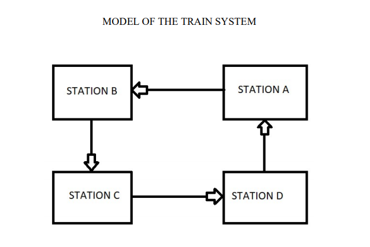
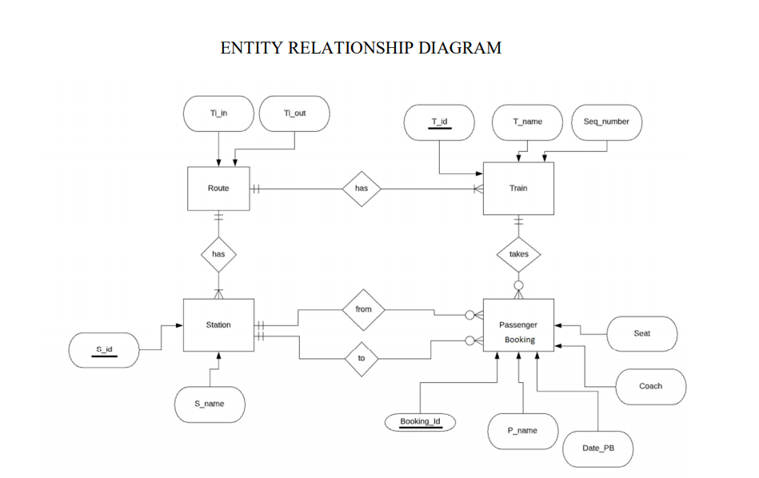
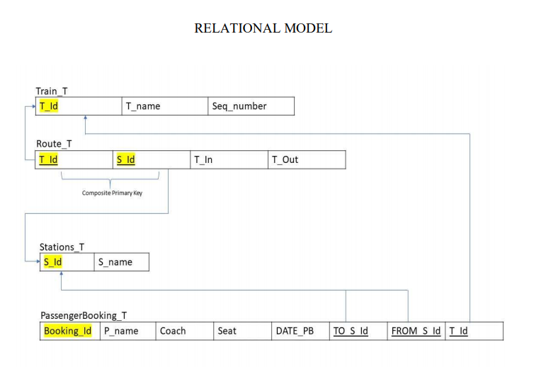
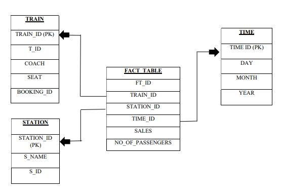

# Railways Database System

Developed a database management system for railways. The project included,

- Designing an entity-relationship diagram.
- Created a relational model.
- Built SQL Schema in MySQL.
- Deployed the the database on Oracle cloud.
- Used data mining techniques to extract data from the database.

Model of the train used in the project,  

  
In the above model 4 stations are connected in a single, uniderictional loop, having only 1 track between 2 consective stations. In this railway system it is assumed that only 4 trains run on these tracks.  

## Entity-Relationship Diagram   

  

## Relational Model   

  

## Data marts for data warehouse -Star Schema   

  

### Group Members   

Aman Budhraja, Arpit Gupta, Rushika Jain, Sathyanath Nandakumar, Srichaitanya Ravupalli
